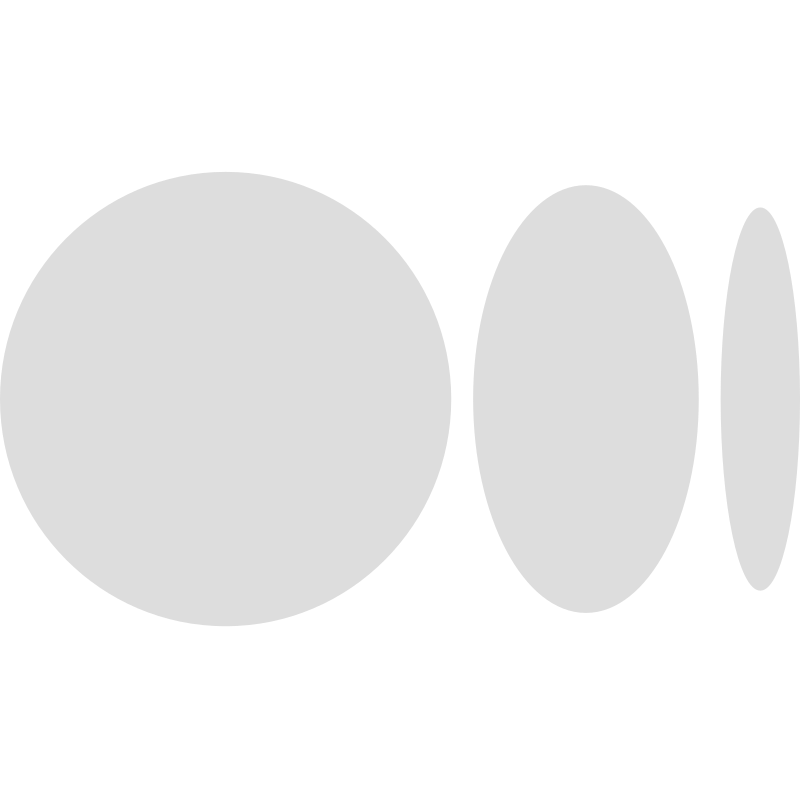
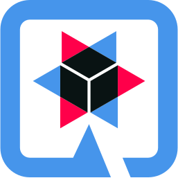

# Hello, I'm Helton 🤠

    
    
    
    
    

 

###  Sou um entusiasta de TI que aspira aprender e difundir muito no campo da tecnologia. Trabalho na área de Desenvolvimento de Software e sou professor particular de programação nas horas vagas.

###  I'm an IT enthusiast aspiring to learn and spread a lot in the field of tech. I work in the Software Development area and I am a private programming teacher in my spare time.

 

## My Toolbox

    
    
    
    <a href="https://quarkus.io/">
        
    
    </a>
    
    
    
    
    
    
    
    
    
    
    
    

 

## My GitHub Stats

