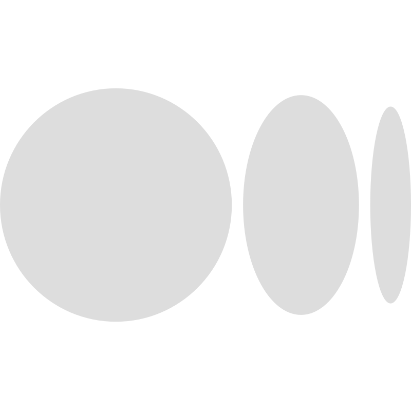

# Hello, I'm Helton.

    
    
    
    
    <a href="https://medium.com/@heltonricardo">
        <picture>
            <source media="(prefers-color-scheme: light)" srcset="assets/medium_for_light.svg" />
            
        </picture>
    </a>

 

 Sou entusiasta de TI, pós-graduado em Inteligência Artificial e Aprendizado de Máquina, e focado em **Desenvolvimento de Software**. Busco aprender, crescer e compartilhar conhecimentos nesses campos para contribuir com projetos inovadores e impactantes. Minha paixão é explorar o mundo da tecnologia e inspirar outros a se envolverem nessa jornada emocionante.

 I am an IT enthusiast, with a postgraduate degree in Artificial Intelligence and Machine Learning, and focused on **Software Development**. My goal is to learn, grow, and share knowledge in these fields to contribute to innovative and impactful projects. I am passionate about exploring the world of technology and inspiring others to join this exciting journey.

 

## Toolbox

<a href="https://github.com/search?l=C&q=user%3Aheltonricardo&type=Repositories">
    <picture>
        <source media="(prefers-color-scheme: light)" srcset="https://img.shields.io/badge/C-fff?logo=c&logoColor=a8b9cc&style=flat-square" />
        
    </picture>
</a>
<a href="https://github.com/search?l=Python&q=user%3Aheltonricardo&type=Repositories">
    <picture>
        <source media="(prefers-color-scheme: light)" srcset="https://img.shields.io/badge/Python-fff?logo=python&logoColor=ffdf5b&style=flat-square" />
        
    </picture>
</a>
<a href="https://github.com/search?l=java&q=user%3Aheltonricardo&type=Repositories">
    <picture>
        <source media="(prefers-color-scheme: light)" srcset="https://img.shields.io/badge/Java-fff?logo=openjdk&logoColor=ca3132&style=flat-square" />
        
    </picture>
</a>
<a href="https://quarkus.io/">
    <picture>
        <source media="(prefers-color-scheme: light)" srcset="https://img.shields.io/badge/Quarkus-fff?logo=quarkus&logoColor=4695eb&style=flat-square" />
        
    </picture>
<a href="https://spring.io/">
    <picture>
        <source media="(prefers-color-scheme: light)" srcset="https://img.shields.io/badge/Spring-fff?logo=spring&logoColor=6db33f&style=flat-square" />
        
    </picture>
</a>
</a>
<a href="https://www.postgresql.org">
    <picture>
        <source media="(prefers-color-scheme: light)" srcset="https://img.shields.io/badge/PostgreSQL-fff?logo=postgresql&logoColor=4169e1&style=flat-square" />
        
    </picture>
</a>
<a href="https://github.com/search?l=HTML&q=user%3Aheltonricardo&type=Repositories">
    <picture>
        <source media="(prefers-color-scheme: light)" srcset="https://img.shields.io/badge/HTML-fff?logo=html5&logoColor=e34f26&style=flat-square" />
        
    </picture>
</a>
<a href="https://github.com/search?l=CSS&q=user%3Aheltonricardo&type=Repositories">
    <picture>
        <source media="(prefers-color-scheme: light)" srcset="https://img.shields.io/badge/CSS-fff?logo=css3&logoColor=1572b6&style=flat-square" />
        
    </picture>
</a>
<a href="https://github.com/search?l=JavaScript&q=user%3Aheltonricardo&type=Repositories">
    <picture>
        <source media="(prefers-color-scheme: light)" srcset="https://img.shields.io/badge/JavaScript-fff?logo=javascript&logoColor=f7df1e&style=flat-square" />
        
    </picture>
</a>
<a href="https://github.com/search?l=TypeScript&q=user%3Aheltonricardo&type=Repositories">
    <picture>
        <source media="(prefers-color-scheme: light)" srcset="https://img.shields.io/badge/TypeScript-fff?logo=typescript&logoColor=3178c6&style=flat-square" />
        
    </picture>
</a>
<a href="https://github.com/search?l=Svelte&q=user%3Aheltonricardo&type=Repositories">
    <picture>
        <source media="(prefers-color-scheme: light)" srcset="https://img.shields.io/badge/Svelte-fff?logo=svelte&logoColor=ff3e00&style=flat-square" />
        
    </picture>
</a>
<a href="https://github.com/search?q=user%3Aheltonricardo+react&type=Repositories">
    <picture>
        <source media="(prefers-color-scheme: light)" srcset="https://img.shields.io/badge/React-fff?logo=react&logoColor=61dafb&style=flat-square" />
        
    </picture>
</a>
<a href="https://nextjs.org/">
    <picture>
        <source media="(prefers-color-scheme: light)" srcset="https://img.shields.io/badge/Next-fff?logo=next.js&logoColor=222&style=flat-square" />
        
    </picture>
</a>
<a href="https://remix.run/">
    <picture>
        <source media="(prefers-color-scheme: light)" srcset="https://img.shields.io/badge/Remix-fff?logo=remix&logoColor=222&style=flat-square" />
        
    </picture>
</a>
<a href="https://www.docker.com/">
    <picture>
        <source media="(prefers-color-scheme: light)" srcset="https://img.shields.io/badge/Docker-fff?logo=docker&logoColor=2496ed&style=flat-square" />
        
    </picture>
</a>
<a href="https://www.jenkins.io">
    <picture>
        <source media="(prefers-color-scheme: light)" srcset="https://img.shields.io/badge/Jenkins-fff?logo=jenkins&logoColor=d24939&style=flat-square" />
        
    </picture>
</a>
<a href="https://kubernetes.io">
    <picture>
        <source media="(prefers-color-scheme: light)" srcset="https://img.shields.io/badge/Kubernetes-fff?logo=kubernetes&logoColor=326ce5&style=flat-square" />
        
    </picture>
</a>

 
 
 

## GitHub Stats

<a href="https://github.com/heltonricardo/github-readme-stats">
    <picture>
        <source media="(prefers-color-scheme: light)" srcset="https://github-readme-stats.vercel.app/api?username=heltonricardo&theme=buefy&bg_color=fff&hide_rank=true&show_icons=true&hide_border=true&count_private=true&number_format=long&disable_animations=true&custom_title=Helton%20Ricardo%20%F0%9F%A4%A0&show=discussions_started,prs_merged,prs_merged_percentage" />
        
    </picture>
</a>

  

  
<i>They see me rollin'</i>

  

    
  

  
<i>They hatin'</i>

